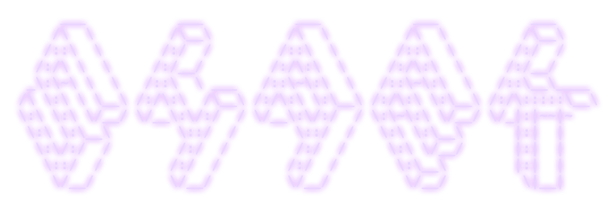

<div align="center">

</div>
<br />
<div align="center">
<a href="https://git.io/typing-svg"></a>
</div>
<p align="center">
  <a href="mailto:shaekahmed69@gmail.com"></a>
</p>

```csharp
var shaek = new {
  WhoAmI = "MD Shaek Ahmed",
  AskMeAbout = new[] { "REST APIs", "RAG systems", "mostly backend stuff", "AI services", "DSA", "system design" },
  Architecture = new[] { "Design Patterns from GoF", "REST", "Clean Code", "Clean Architecture", "microservices" },
  CurrentFocus = "Building reliable, scalable AI-powered backends, distributed systems and inference",
  Seeking = new[] { "SWE", "SDE", "AI Engineer", "Forward Deployed Engineer", "Inference Engineer", "ML Engineer" },
  FunFact = "If I were on the larper Mount Rushmore, I'd be at index 0",
  GOAT = "Messi"
};
```

<h3 align="center">Featured Projects</h3>

<div align="center">

<table>
  <tr>
    <th align="left">Project</th>
    <th align="left">Description</th>
    <th align="left">Tech</th>
    <th align="left">Links</th>
  </tr>
  <tr>
    <td><b>ForgeORM</b></td>
    <td align="left">Lightweight PostgreSQL ORM from scratch with ADO.NET, reflection, migrations</td>
    <td>
      
      
      
    </td>
    <td><a href="https://github.com/shaek666/ForgeORM">Code</a></td>
  </tr>
  <tr>
    <td><b>StackOverflow-Lite</b></td>
    <td align="left">Q&A REST API, Clean Architecture, JWT, voting, tags, reputation</td>
    <td>
      
      
      
    </td>
    <td><a href="https://github.com/shaek666/StackOverflow-Lite">Code</a></td>
  </tr>
  <tr>
    <td><b>lore-hound</b></td>
    <td align="left">AI agent that hunts codebases, extracts patterns, Django-PostgreSQL</td>
    <td>
      
      
      
      
    </td>
    <td><a href="https://github.com/shaek666/lore-hound">Code</a></td>
  </tr>
  <tr>
    <td><b>MultiLabel-BoardGame-Classifier</b></td>
    <td align="left">90-category text classifier from descriptions</td>
    <td>
      
      
      
    </td>
    <td><a href="https://github.com/shaek666/MultiLabel-BoardGame-Category-Classifier">Code</a> · <a href="https://multilabel-boardgame-category-classifier.onrender.com/">Demo*</a></td>
  </tr>
</table>
<p><sub>* Live demo runs on Render's free tier (yeah in this economy, don't judge me), first load can take several minutes while the instance spins up. Be patient.</sub></p>

</div>

<h3 align="center">Tech Stack</h3>
<div align="center">
<b>Languages</b><br /><br />
       
</div>
<br />
<div align="center">
<b>Backend & APIs</b><br /><br />
         
</div>
<br />
<div align="center">
<b>AI / ML</b><br /><br />
   
</div>
<br />
<div align="center">
<b>Frontend</b><br /><br />
         
</div>
<br />
<div align="center">
<b>Data</b><br /><br />
     
</div>
<br />
<div align="center">
<b>DevOps</b><br /><br />
      
</div>
<br />
<div align="center">
<b>Other Tools</b><br /><br />
   
</div>
<br />
<h3 align="center">Suffering Plaque</h3>
<div align="center">

</div>
<p align="center"><sub>Learning it till earning it!</sub></p>
